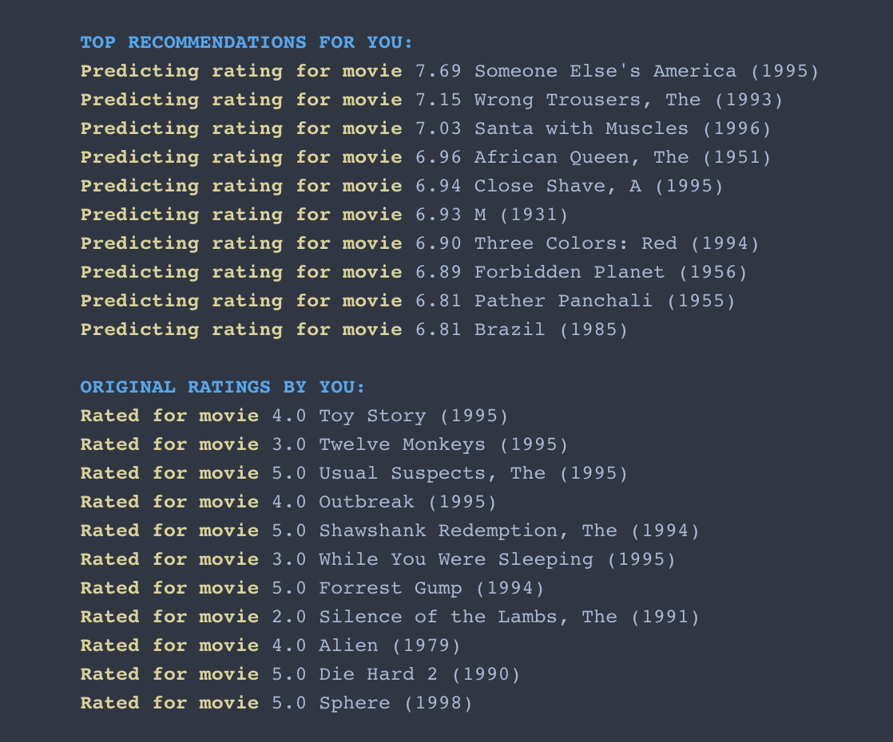

# Movie Recommendations using Collaborative Filtering.

Dataset: 100k movie ratings dataset. Source: [Data link](https://grouplens.org/datasets/movielens/100k/)

 **The idea/concept**: 
In the simplest sense, Collaborative Filtering is the process of recommending users items based on what other users think of a those items. For example, consider two users Peter and John. Peter likes the colors, Blue , Green, Black and Yellow. John likes Green, Black and Blue. So we can predict that John also might, with some certainty, like Yellow as well. This is the process of basing recommendations based on users with similar tastes.

The algorithm says there must be a certain matrix **X** and a certain matrix **θ** such that, the dot product of these matrices, give us a resultant matrix which is the user VS item prediction score matrix. This two factor matrices approach is also called **[Matrix Factorization](https://en.wikipedia.org/wiki/Matrix_factorization_(recommender_systems))**. 

PRED_SCORE = **θ**.tranpose().dot(**X**), here the user *j* will have given PRED_SCORE[ *i* ][ *j* ] to a movie *i*.

We initialise **θ** and **X** matrices with random values and start a gradient descent on the cost function, which here, we are using the squared loss error. The resultant matrices after convergence will give us predict ratings. 
Thereon, we can gather top 10-20-30..*N* ratings for a user and recommend the corresponding list of items, which here are movies.

The algorithm has been [implemented and analyzed](./CollabFil/cofil_ratings.ipynb) in this repository.

## Relevant links:
- [Recommendation engines](https://www.analyticsvidhya.com/blog/2018/06/comprehensive-guide-recommendation-engine-python/)
- [Group Lens dataset](https://grouplens.org/datasets/movielens/100k/)
- [Andrew Ng Videos](https://www.youtube.com/watch?v=YW2b8La2ICo&list=PLLssT5z_DsK-h9vYZkQkYNWcItqhlRJLN&index=99)

